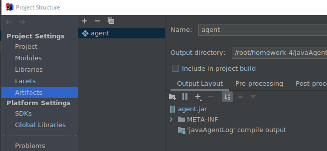
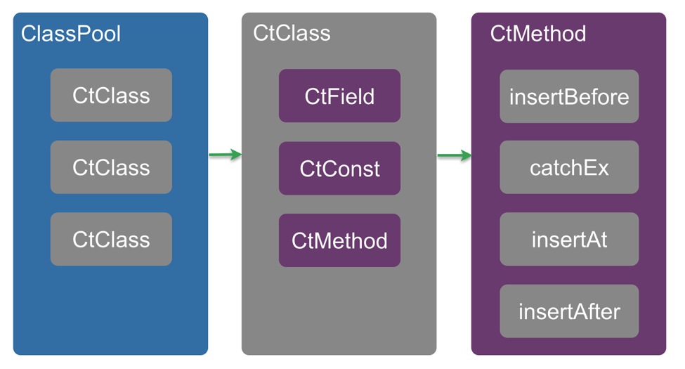

# 代码动态分析
## 编译map-reduce
### 安装jdk-1.8和maven
略

### 安装protobuf-2.5.0
采用编译安装的方式安装

#### 下载源码，解压
    wget https://github.com/protocolbuffers/protobuf/archive/v2.5.0.zip
    unzip protobuf-2.5.0.zip

#### 安装依赖
    sudo apt-get install autoconf automake libtool curl make g++ unzip -y

#### 编译
```bash
./autogen.sh
./configure
make
sudo make install
sudo ldconfig
```

#### 查看版本
    protoc --version
    libprotoc 2.5.0

### 下载hadoop源码，解压
    wget https://github.com/apache/hadoop/archive/rel/release-3.2.2.zip
    unzip release-3.2.2.zip

### 编译
    cd hadoop-rel-release-3.2.2/
    mvn package -Pdist -DskipTests -Dtar

### 生成文件在hadoop-dist/target下
    cp -r  hadoop-dist/target/hadoop-3.2.2 ..
    cd ../hadoop-3.2.2/

### 尝试以standalone模式运行
```bash
$ mkdir input
$ cp etc/hadoop/*.xml input
$ bin/hadoop jar share/hadoop/mapreduce/hadoop-mapreduce-examples-3.2.2.jar grep input output 'dfs[a-z.]+'
$ cat output/*
```

结果：

    1	dfsadmin

## WordCount 
### WordCount.java
```java
import java.io.IOException;
import java.util.StringTokenizer;

import org.apache.hadoop.conf.Configuration;
import org.apache.hadoop.fs.Path;
import org.apache.hadoop.io.IntWritable;
import org.apache.hadoop.io.Text;
import org.apache.hadoop.mapreduce.Job;
import org.apache.hadoop.mapreduce.Mapper;
import org.apache.hadoop.mapreduce.Reducer;
import org.apache.hadoop.mapreduce.lib.input.FileInputFormat;
import org.apache.hadoop.mapreduce.lib.output.FileOutputFormat;

public class WordCount {

  public static class TokenizerMapper
       extends Mapper<Object, Text, Text, IntWritable>{

    private final static IntWritable one = new IntWritable(1);
    private Text word = new Text();

    public void map(Object key, Text value, Context context
                    ) throws IOException, InterruptedException {
      StringTokenizer itr = new StringTokenizer(value.toString());
      while (itr.hasMoreTokens()) {
        word.set(itr.nextToken());
        context.write(word, one);
      }
    }
  }

  public static class IntSumReducer
       extends Reducer<Text,IntWritable,Text,IntWritable> {
    private IntWritable result = new IntWritable();

    public void reduce(Text key, Iterable<IntWritable> values,
                       Context context
                       ) throws IOException, InterruptedException {
      int sum = 0;
      for (IntWritable val : values) {
        sum += val.get();
      }
      result.set(sum);
      context.write(key, result);
    }
  }

  public static void main(String[] args) throws Exception {
    Configuration conf = new Configuration();
    Job job = Job.getInstance(conf, "word count");
    job.setJarByClass(WordCount.class);
    job.setMapperClass(TokenizerMapper.class);
    job.setCombinerClass(IntSumReducer.class);
    job.setReducerClass(IntSumReducer.class);
    job.setOutputKeyClass(Text.class);
    job.setOutputValueClass(IntWritable.class);
    FileInputFormat.addInputPath(job, new Path(args[0]));
    FileOutputFormat.setOutputPath(job, new Path(args[1]));
    System.exit(job.waitForCompletion(true) ? 0 : 1);
  }
}
```
### 设置HADOOP_CLASSPATH
    export HADOOP_CLASSPATH=${JAVA_HOME}/lib/tools.jar

### 创建jar包
    $ bin/hadoop com.sun.tools.javac.Main WordCount.java
    $ jar cf wc.jar WordCount*.class

### 清空input，在input随便放篇文章，删除output
```bash
rm input/*
nano input/Gettysburg_Address.txt
rm -r output
```

### 运行
    bin/hadoop jar wc.jar WordCount input output

### 查看结果
    cat output/part-r-00000

结果（部分）：

    for	4
    forget	1
    forth	1
    freedom	1
    from	2
    full	1
    gave	1
    government	1
    great	3
    ground	1
    hallow	1
    hallowed	1
    have	3
    here	7


## javaagent
### idea创建空的java项目，src里添加javaAgentLog包


### 创建测试用的agent类
```java
package javaAgentLog;

import java.lang.instrument.Instrumentation;

public class Agent {

    public static void premain(String agentArgs, Instrumentation inst) {
        System.out.println("## into premain");
        inst.addTransformer((classLoader, s, aClass, protectionDomain, bytes) -> {
            if(s.startsWith("org/apache/hadoop"))
                System.out.println("## transform:" + s);
            return bytes;
        });
    }
}
```

其中premain在jar包main函数执行之前调用，通常通过设置Instrumentation来告诉jvm如何处理输入的字节码。

通过添加transformer来实现对类的修改，当jvm加载类时，会逐个调用transformer。

lambda函数的s参数是类名，bytes为原始的字节码，返回值为修改后的字节码。

### build
### 创建jar包
File -> Project Structure -> Artifacts

添加jar包，from modules and dependencies。

命名为agent



### manifest
选中jar包，新建manifest

在新建的MANIFEST.MF中添加Premain-Class

    Premain-Class: javaAgentLog.Agent

### 生成jar包
build -> build artifacts

### 将agent.jar 复制到hadoop目录下
     cp out/artifacts/agent/agent.jar ../hadoop-3.2.2/

### 运行
设置环境变量（相当于java -javaagent:agent.jar xxx）

     export HADOOP_OPTS="-javaagent:agent.jar $HADOOP_OPTS"

运行

    rm -r output/
    bin/hadoop jar wc.jar WordCount input output

结果（部分）

    ## into premain
    ## transform:org/apache/hadoop/util/RunJar
    ## transform:org/apache/hadoop/util/ApplicationClassLoader
    ## transform:org/apache/hadoop/io/IOUtils$NullOutputStream
    ## transform:org/apache/hadoop/log/metrics/EventCounter
    ## transform:org/apache/hadoop/log/metrics/EventCounter$EventCounts
    ## transform:org/apache/hadoop/util/ShutdownHookManager
    ## transform:org/apache/hadoop/util/ShutdownHookManager$1
    ## transform:org/apache/hadoop/util/concurrent/HadoopExecutors

可以看到先执行premain函数，后对于每个加载的类调用transformer。


## Javassist 
javassist 用于对字节码进行修改。

javassist结构大致如图，classpool里有所有classpath下的类。CtClass对应类，CtMethod对应类方法。



### 下载
从https://mvnrepository.com/artifact/org.javassist/javassist 下载最新的javassist。

放到项目目录下

### 添加依赖
File -> Project Structure -> modules

在右侧的dependencies里添加javassist的jar包

将javassist的jar包放到share/hadoop/common/lib下


### 修改agent.java
```java
package javaAgentLog;

import javassist.CannotCompileException;
import javassist.ClassPool;
import javassist.CtClass;
import javassist.CtMethod;

import java.lang.instrument.Instrumentation;

public class Agent {
    private static String systemPrint(String prefix, String methodName) {
        return "System.out.println(\"__" + prefix + "__ " + methodName + ": \" + System.nanoTime() + \" \" + Thread.currentThread().getId());";
    }

    public static void premain(String agentArgs, Instrumentation inst) {
        ClassPool cp = ClassPool.getDefault();
        inst.addTransformer((classLoader, s, aClass, protectionDomain, bytes) -> {
            if (s.startsWith("org/apache/hadoop")) {
                try {
                    CtClass cc = cp.get(s.replace('/', '.'));
                    for (CtMethod m : cc.getDeclaredMethods()) {
                        try {
                            m.insertBefore(systemPrint("enter", cc.getName() + " " + m.getName()));
                            m.insertAfter(systemPrint("exit", cc.getName() + " " + m.getName()));
                        }catch (CannotCompileException ignored){}
                    }
                    byte[] byteCode = cc.toBytecode();
                    cc.detach();
                    return byteCode;
                } catch (Exception ex) {
                    ex.printStackTrace();
                }
            }
            return bytes;
        });
    }
}
```

通过System.nanoTime()获取时间戳，Thread.currentThread().getId()获取线程号。

利用CtMethod的insertBefore方法在函数执行前插入代码；insertAfter方法在函数执行后插入代码。

### 运行结果
    rm -r output/
    bin/hadoop jar wc.jar WordCount input output >out.txt

结果（部分）：

```
__enter__ org.apache.hadoop.io.DataInputBuffer$Buffer skip: 83490333961978 52
__exit__ org.apache.hadoop.io.DataInputBuffer$Buffer skip: 83490333978861 52
__exit__ org.apache.hadoop.mapreduce.task.reduce.InMemoryReader nextRawValue: 83490333981847 52
__exit__ org.apache.hadoop.mapred.Merger$Segment nextRawValue: 83490333984502 52
__exit__ org.apache.hadoop.mapred.Merger$Segment getValue: 83490333987208 52
__enter__ org.apache.hadoop.mapred.Merger$Segment getReader: 83490334006375 52
__exit__ org.apache.hadoop.mapred.Merger$Segment getReader: 83490334009023 52
__enter__ org.apache.hadoop.util.Progress set: 83490334023256 52
__exit__ org.apache.hadoop.util.Progress set: 83490334145560 52
__exit__ org.apache.hadoop.mapred.Merger$MergeQueue next: 83490334183965 52
__enter__ org.apache.hadoop.mapred.Merger$MergeQueue getKey: 83490334187708 52
__exit__ org.apache.hadoop.mapred.Merger$MergeQueue getKey: 83490334190402 52
__enter__ org.apache.hadoop.mapred.Merger$MergeQueue getValue: 83490334193223 52
__exit__ org.apache.hadoop.mapred.Merger$MergeQueue getValue: 83490334195930 52
__enter__ org.apache.hadoop.mapred.IFile$Writer append: 83490334198848 52
__enter__ org.apache.hadoop.io.DataInputBuffer getLength: 83490334201695 52
```

## 性能瓶颈

### 找出调用次数最多的函数

```python
from functools import reduce


def func(t, s):
    if s in t:
        t[s] += 1
    else:
        t[s] = 1
    return t


with open("out.txt") as f:
    stats = reduce(func, map(lambda x: x.split(":")[0].split("__")[-1], f.readlines()), {})
    print(reduce(lambda t, s: t if t[1] > s[1] else s, stats.items()))
```

### 结果
    (' org.apache.hadoop.conf.Configuration$Parser parseNext', 596768)

org.apache.hadoop.conf.Configuration$Parse类下的parseNext方法可能是性能的瓶颈。